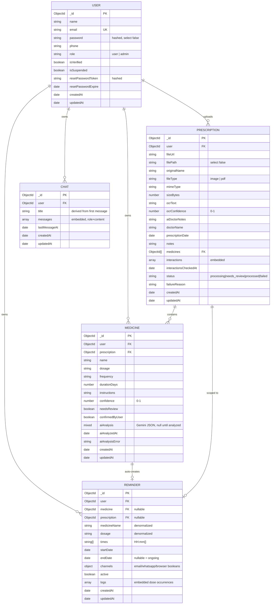

# MedAssist — Database Schema

MongoDB via Mongoose. Five top-level collections, matching the project
spec: **Users**, **Prescriptions**, **Medicines**, **Reminders**, **Chats**.
Reminder dose logs and chat messages are embedded subdocuments rather
than separate collections (see the note on each below) — both are
always read and written together with their parent, so embedding avoids
an extra query/join for the common case at the cost of the parent
document growing over time, which is an acceptable tradeoff at expected
per-user volumes.

## Entity-relationship overview

## Collections in detail

### `users`

| Field | Type | Notes |
|---|---|---|
| `name` | String | required, max 60 chars |
| `email` | String | required, unique, lowercased |
| `password` | String | bcrypt hash (cost 12), `select: false` — never returned by default |
| `phone` | String | optional |
| `avatar` | String | optional URL |
| `role` | String enum | `"user"` \| `"admin"`, default `"user"` |
| `isVerified` | Boolean | reserved for future email verification |
| `isSuspended` | Boolean | Phase 7 — blocks login and every existing session when `true` |
| `resetPasswordToken` | String | SHA-256 hash of the emailed reset token, never the raw token |
| `resetPasswordExpire` | Date | 30 minutes from generation |

`toJSON()` is overridden to strip `password`, `resetPasswordToken`, and
`resetPasswordExpire` from every response, so there's no risk of a
route accidentally leaking them.

**Indexes:** `email` (unique, from `required: true, unique: true`).

### `prescriptions`

One document per uploaded file. `filePath` (the absolute disk path) has
`select: false` since it's an internal detail the API never needs to
return to the client — `fileUrl` (the public `/uploads/...` path) is
what the frontend uses.

`status` lifecycle: `processing` → (`needs_review` if any medicine came
back low-confidence, or `failed` if Gemini Vision extraction errored) →
`processed` once every flagged medicine has been confirmed.

`interactions` is populated by Phase 4's cross-prescription drug
interaction check — an array of `{medicineA, medicineB, severity,
description}`, embedded rather than a separate collection since it's
always read alongside the prescription that triggered the check.

**Indexes:** `user` (single), `status` (single), `{user: 1, createdAt:
-1}` compound (backs the paginated history query, newest first).

### `medicines`

One document per medicine extracted from a prescription (or added
manually). `confidence` and `needsReview` drive the review workflow —
below `REVIEW_CONFIDENCE_THRESHOLD` (0.6, defined in
`services/ocrService.js`), a medicine is flagged for the user to confirm
or correct before it's trusted anywhere else in the app (interaction
checks, chat context, reminders).

`aiAnalysis` is `Mixed` rather than a fixed subdocument shape because it
stores whatever `geminiService.analyzeMedicine()` returns verbatim
(`summary`, `commonUses`, `sideEffects.common/serious`, `precautions`,
`disclaimer`) — Mixed avoids having to keep a rigid schema in lockstep
with prompt changes.

**Indexes:** `user` (single), `prescription` (single), `{user: 1, name:
1}` compound, `{user: 1, needsReview: 1}` compound (added in Phase 8 —
backs the "all of this user's confirmed medicines" query used by both
the chatbot's context builder and the interaction-check step, which is
the exact filter shape run there).

### `reminders`

One document per medicine's recurring schedule. `medicine` and
`prescription` are nullable since a reminder can be fully manual
(not tied to a scanned medicine). `medicineName`/`dosage` are
denormalized copies so a reminder still reads sensibly even if the
source medicine is later edited.

`times` is a plain `["HH:mm", ...]` array validated against a 24-hour
regex — see the README's timezone note (times are interpreted in the
**server's** local time; there's no per-user timezone field yet).

**`logs` (embedded, not a separate collection):** one entry per
scheduled occurrence, e.g. "8am dose on July 27" — `{scheduledFor,
status, notifiedAt, takenAt, channelsNotified}`. `status` moves
`pending` → `due` (when the cron dispatch tick fires) → `taken` (user
action) or `missed` (auto-swept after a 3-hour grace period). Embedded
because a reminder's dose history is always queried together with the
reminder itself — the dashboard's "today's occurrences" view merges
these logs with virtually-computed future slots (see
`services/reminderService.js`).

**Indexes:** `user` (single), `active` (single), `{user: 1, active: 1}`
compound (backs "this user's active reminders", the scheduler's core
query pattern).

### `chats`

One document per conversation thread. `title` is derived from the first
message (truncated client-visible text, not a separate AI call — see
`utils/deriveTitle.js`).

**`messages` (embedded, not a separate collection):** `{role: "user" |
"assistant", content, createdAt}`. Embedded for the same reason as
reminder logs — a conversation's messages are always rendered together
with the conversation, so there's no scenario where fetching them
separately would help.

**Indexes:** `user` (single), `lastMessageAt` (single), `{user: 1,
lastMessageAt: -1}` compound (backs the sidebar's "most recently active
conversations first" query).

## Relationships

- A `User` owns many `Prescription`, `Medicine`, `Reminder`, and `Chat`
  documents (`user` foreign key on each, cascade-deleted together when
  an admin deletes a user — see `admin.controller.js`).
- A `Prescription` owns many `Medicine` documents (`prescription`
  foreign key on `Medicine`, plus a denormalized `medicines[]` array of
  ObjectIds on `Prescription` for direct population without a reverse
  lookup).
- A `Medicine` optionally has one `Reminder` (created automatically the
  moment the medicine is confirmed — see `services/reminderService.js`
  → `autoCreateReminderForMedicine()`).
